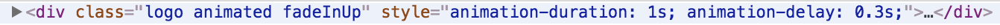

# AWA1 - Documentation
## Technologies & Librairies
## Animations
### Animation du background
L'affichage progressive du background s'effectue tout simplmenent via la propritété css **filter** avec la valeure **blur()**.  
```
	body.is-loading #header {
	  -moz-filter: blur(0.125rem);
	  -webkit-filter: blur(0.125rem);
	  -ms-filter: blur(0.125rem);
	  filter: blur(0.125rem);
	}
```
La propritété est encapsulé dans une classe spécifique de telle manière à ce qu'elle puisse être rajouté dynamiquement en javascript.  
```
	background.className += "is-loading";
```
Il en est de même pour le floutage du fond lors de la visualiation d'un article qui s'ajoute et s'enlève dynamiquement.
  

### Animation du logo

L'animation du **logo** s'effectue grâce à la libraire [animate.css](https://daneden.github.io/animate.css/).  
De cette manière, l'apparition du **logo** est séparée des autres éléments.
L'utilisation de **animate.css** est placé dans [animate.css.js](../assets/js/animate.css.js).  
```
	animateCss(logo, 'fadeInUp', {"animation-duration": "1s", "animation-delay" : "0.3s"});
```
L'idée est d'ajouter une **classe css contenant qui va effectuer une animation** à noeud du DOM.  


### Animation page principale
  
L'animation du **logo** (ci-dessous) s'effectue grâce à la librairie [animate.css](https://daneden.github.io/animate.css/).  

### Animation des articles

### Note pour document PDF
Cette documentation a initialement été créé au format **markdown**.
Les gifs ainsi que les liens ne seront donc pas correctement
