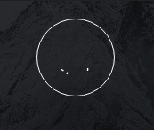

# AWA1 - Documentation
## Technologies & Librairies
* https://github.com/daneden/animate.css
* https://github.com/juliangarnier/anime 
* http://dynamicsjs.com/
* https://github.com/jschr/textillate

## Animations
### Background
L'affichage progressive du background s'effectue tout simplmenent via la propritété css **filter** avec la valeure **blur()**.  
```
	body.is-loading #header {
	  -moz-filter: blur(0.125rem);
	  -webkit-filter: blur(0.125rem);
	  -ms-filter: blur(0.125rem);
	  filter: blur(0.125rem);
	}
```
La propritété est encapsulé dans une classe spécifique de telle manière à ce qu'elle puisse être rajouté dynamiquement en javascript.  
```
	background.className += "is-loading";
```
Il en est de même pour le floutage du fond lors de la visualiation d'un article qui s'ajoute et s'enlève dynamiquement.
  

### Logo
Le logo, qui est un **SVG** s'anime grâce à la librairie [animate.css](https://github.com/daneden/animate.css).  
  
Le code est situé dans le fichier `assets/js/anime.js`.  

```javascript
var lineDrawing = anime({
    targets: '.logo .lines path',
    strokeDashoffset: [anime.setDashoffset, 0],
    easing: 'easeInOutSine',
    duration: 2000,
    direction: 'alternate',
    delay: 2000,
    loop: false
});
``` 

### Menu
Le menu est un élément html de type **nav**, s'animant une fois de plus via la librairie [animate.css](https://github.com/daneden/animate.css).  
Le code est situé dans le fichier `assets/js/anime.js`.  
  
```javascript
var el = document.querySelector('#header nav ul');
el.style.transform += "scale(0.4)";
var menuAnime = anime({
    targets: el,
    duration: 1500,
    easing: "easeInOutQuad",
    duration: 1000,
    scale: {
        value: 1,
        duration: 1600,
        delay: 2200,
        easing: 'easeInOutQuart'
    }
});
``` 

### Texte
Encore une fois sur la page d'accueil, le **texte** s'affiche via une animation faite via la librairie [textillate](https://github.com/jschr/textillate).  
Le code est situé dans le fichier `assets/js/textillate.js`.  
  
```javascript 
$('#header .content .inner > :last-child').textillate({
    initialDelay: 1500,
    in: { effect: 'fadeIn' },
    sync: true
});
```

### Article menu
Les titres des **articles** ont également une petite animation qui s'effectue lors du passage de la souris sur l'élément.  
Contraireemnt aux autres animations, le tout est fait en pur css.
Le style css est situé dans `assets/css/anim.css`.


```css
.animate-link{
    display: inline-block;
    color: #fff;
    text-decoration: none;
}

.animate-link::after {
    content: '';
    display: block;
    width: 0;
    height: 4px;
    background: white;
    transition: width .3s;
}

.animate-link:hover::after {
    width: 100%;
}
```
### Footer
Plus subtile, le **footer** est également animé. L'année **2018** s'incrémente de façon linéaire de 1 à 2018.  
L'animation est faite grâce à la librairie [animate.css](https://github.com/daneden/animate.css).
Le code est situé dans le fichier `assets/js/anime.js`.  


```javascript
var obj_ = { Bouricci: 0 };
var JSobject = anime({
    targets: obj_,
    Bouricci: 2018,
    duration: 6000,
    round: 1,
    easing: 'linear',
    update: function() {
        var el = document.querySelector('#footer_year');
        el.innerHTML = JSON.stringify(obj_);
    }
});
```
### Loading 
Une animation de **chargement** est lancée lors de l'envoi de formulaire via la librairie [dynamicsjs](http://dynamicsjs.com/).  
Le code est situé dans le fichier `assets/js/loading.js` pour le javascript  et dans `assets/css/anim.css` pour le style css des points.  

```javascript
// selects the dots divs
var dots = document.querySelectorAll('.dot')
// assigne colors
var colors = ['#ecf0f1', '#95a5a6', '#7f8c8d']
// iterates on the dots
for(var i=0; i<dots.length; i++) {
        dynamics.animate(dots[i], {
            translateY: -70,
            backgroundColor: colors[i]
        }, {
            type: dynamics.forceWithGravity,
            bounciness: 800,
            elasticity: 200,
            duration: 2000,
            delay: i * 450
        })
    }
    dynamics.setTimeout(animateDots, 2500)
```
```css
.dot{
    display: none;
    float: left;
    margin: 0 4px;
    width: 24px;
    height: 24px;
    border-radius: 12px;
    background: black;
}
``` 
Si l'animation s'effectue plusieurs fois, l'effet de gravité sur les éléments est cumulé, donnant un effet bizarre (illustration ci-dessous).  
Une variable `lock` est donc assignée pour s'assurer que l'animation ne se lance qu'une fois.  
  
Le bouton **reset** cache également l'animation.  


